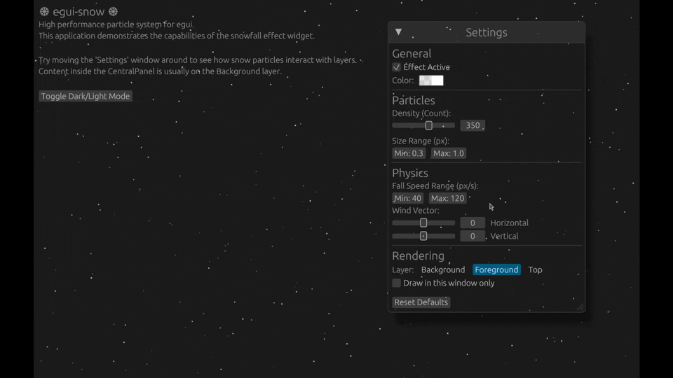

# egui-snow

[](https://crates.io/crates/egui-snow)
[](https://docs.rs/egui-snow)
[](https://github.com/LaVashikk/egui-snow/blob/main/LICENSE)

A lightweight, performant snowfall effect widget for [egui](https://github.com/emilk/egui). 

It renders particles on top of your UI (or behind it) without affecting layout allocation. Ideally suited for festive themes or atmospheric effects.

[**Run Web Demo**](https://lavashikk.github.io/egui-snow/)



## Usage

Add to `Cargo.toml`:
```toml
[dependencies]
egui = "0.34"
egui-snow = "0.34"
```

In your update loop:

```rust
use egui_snow::Snow;

fn ui(&mut self, ui: &mut egui::Ui, ...) {
    // Render your UI...
    egui::CentralPanel::default().show_inside(ui, |ui| {
        ui.label("Hello, Winter!");
    });

    // Render snow on top
    Snow::new("snow_effect")
        .color(egui::Color32::from_white_alpha(200))
        .speed(40.0..=100.0)
        .size(0.5..=3.0)
        .show(ui);
}
```
